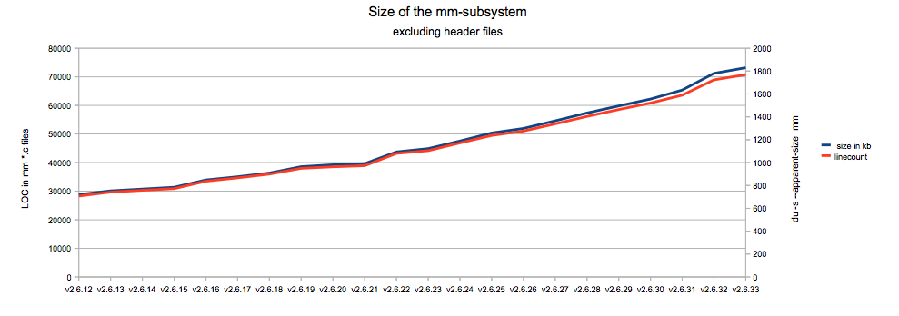

Content
========

Analyses tools for the Linux memory management.

mm-diff
-------------
`mm-diff` works on the kernels git repository, and analyses the source code.

Example charts generated via OpenOffice:

page_usage
-------------
Tools to collect and analyse the kernels runtime behaviour by tracing the state of the page frames (struct page).

Example video showing the usage of ANON and MMAPed memory while compiling the Linux Kernel:

