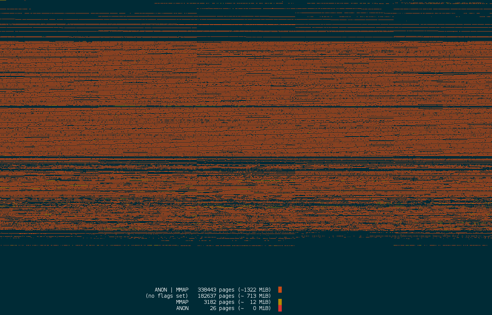
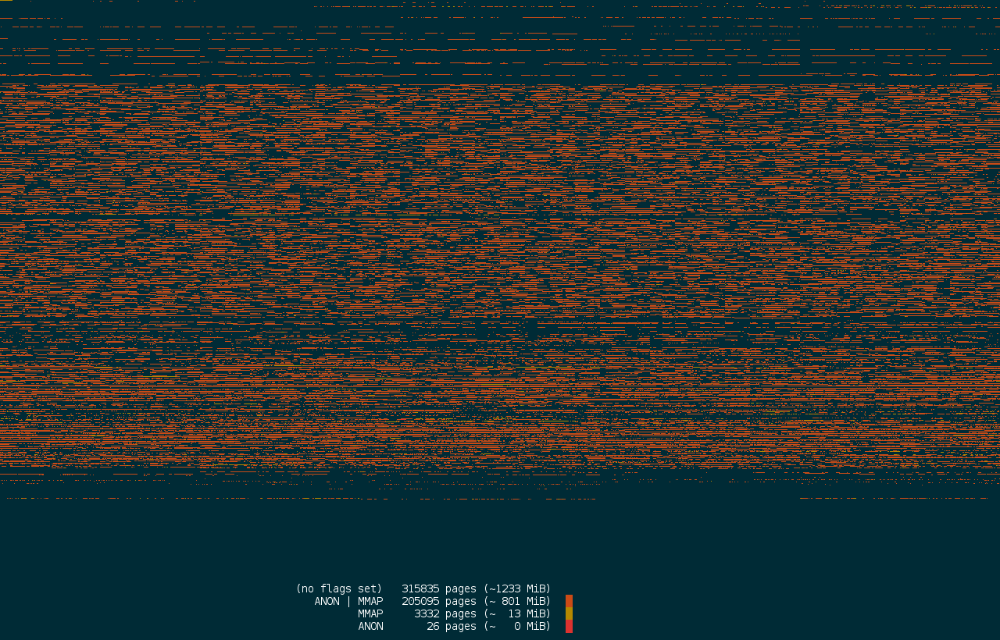
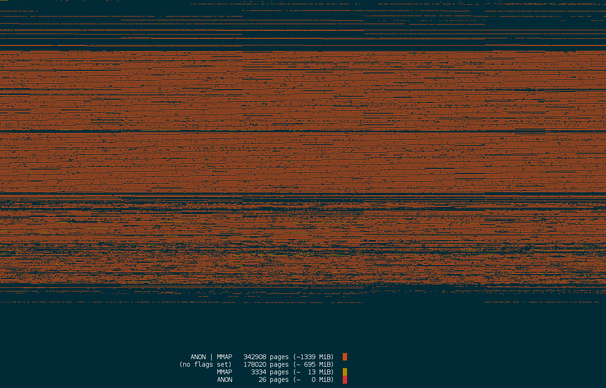

Content
========

1. `collect` -- Collect information about the kernels management of memory by dumping `kpageflags` and `kpagecount`.
2. `analyzing` -- Analyses the dumps, and creates images/videos.
3. `samples` -- Example dumps.

How does it look like?
-----------------------------

The following three images, taken approx. 15 seconds apart, show how quickly page (most computers manage memory in chunks of 4KB called _page_. If you want to know more on pages see below for an explanation.) usages change by visualising the usage of RAM for user processes, e.g. a Document-Editor, a Browser, etc. One pixel represents 4KB of RAM (33554432 bits).

In the first image nearly all of the systems memory (1334 of 2048 MB) is allocated to user processes via `mmap` or as anonymous memory. In this case the user processes where compiling the Linux kernel, but they also could be spreadsheet programs. 15 seconds later this drops to 814 MB, then raises to 1352 MB of RAM used by programs. This shows that each memory cell is used for many different programs/things during a day.

1.  Page (memory) allocation to user processes while compiling Linux. The page-flags logically ANDed with `page.flags & (ANON | MMAP )` prior visualisation.  _(no flags set)_ only refers to `ANON`/`MMAP`.
2.  Same system 15 seconds later, only 814 MB allocated to user space programs.
3.  Another 17 seconds later: back to 1352 MB.

The images can be stitched together as a video:

